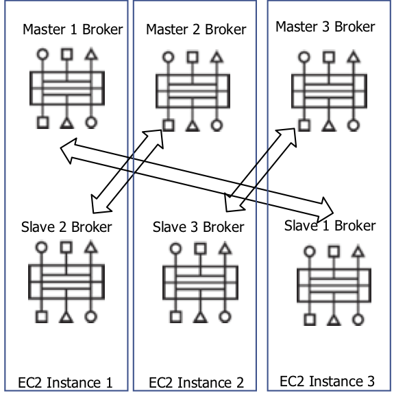

# AMQ 7.x Master / Slave Replicated Cluster on EC2


This project demonstrates how to setup a six-node AMQ 7 cluster (using shared-nothing replication) within a single Amazon EC2 Availability Zone (AZ).  Please note that although this architecture *may* work cross-AZ, it is not recommended nor supported.



## Prerequisites

The following product / OS prerequisites exist:

* RHEL 7.3 (with an activated subscription).  Make sure you have run `sudo yum install libaio`.
* EC2 c4.xlarge instance type
* AMQ 7.3.x+ Broker (install from [here](https://access.redhat.com/jbossnetwork/restricted/softwareDownload.html?softwareId=67801))
* The legacy ActiveMQ client JAR which supports OpenWire failover [here](https://mvnrepository.com/artifact/org.apache.activemq/activemq-all/5.14.5)

## Procedure

### Setup EC2

To get things started, we need to setup three separate EC2 instances.

1. Provision three RHEL 7.3, c4.xlarge instances.
2. Associate three separate Elastic IP's to each instance.  Name them Master, Slave One, and Slave Two.


3. As part of the setup process, be sure to create a Security Group that opens up inbound ports 61616, 61617, 22, 80, 8161, and 8162.  All outbound traffic should be left open.


4. Startup each instance, and secure copy the AMQ 7 binary to each machine:

```
scp -i ~/Downloads/ec2-ssh.pem ~/Downloads/amq-broker-7.3.0-bin.zip ec2-user@XX.XX.XX.XX.compute-1.amazonaws.com:
```

5. For each instance, unzip the binary and run the following command from the `amq-broker-7.3.0-bin` directory:

```
./bin/artemis create brokers/masterX
```

replacing `X` with the broker number.  Set the username and password to `admin`, and set Anonymous Access to `Y`.  Do the same for Slaves One, Two and Three instances, except change the artemis setup command to:

```
./bin/artemis run brokers/slaveX --port-offset=1
```

replacing `X` with your instance name.


6. For each instance, open the `amq-broker-7.3.0-bin/brokers/<instance name>/etc/bootstrap.xml` file and update the bind address to listen on all network addresses (`0.0.0.0`):

```
<!-- The web server is only bound to localhost by default -->
<web bind="http://0.0.0.0:8161" path="web">
    <app url="redhat-branding" war="redhat-branding.war"/>
    <app url="artemis-plugin" war="artemis-plugin.war"/>
    <app url="console" war="console.war"/>
</web>
```

7. For each instance, open the `amq-broker-7.3.0-bin/brokers/<instance name>/etc/jolokia-access.xml` file and update the CORS allow origin section to accept remote addresses:

```
        <allow-origin>*://*</allow-origin>
```
8. Copy and replace the `amq-broker-7.3.0-bin/brokers/<instance name>/etc/broker.xml` file with the corresponding `broker.xml` for each instance.  Make sure you replace the `serv1.serv1.serv1.serv1` with the EC2 Instance One Elastic IP, `serv2.serv2.serv2.serv2` with the EC2 Instance Two Elastic IP, and `serv3.serv3.serv3.serv3` with the Slave Three Elastic IP in the `<connectors>` section:

```
<connectors>
   <!-- connector to master1, group1, server1 -->
    <connector name="netty-connector">tcp://serv1.serv1.serv1.serv1:61616</connector>
    <!-- connector to the slave1, group1, server3 -->
   <connector name="s1-connector">tcp://serv3.serv3.serv3.serv3:61617</connector>

    <!-- connector to the master2, group2, server2 -->
    <connector name="m2-connector">tcp://serv2.serv2.serv2.serv2:61616</connector>
    <!-- connector to the slave2, group2, server1 -->
    <connector name="s2-connector">tcp://serv1.serv1.serv1.serv1:61617</connector>

     <!-- connector to the master3, group3, server3 -->
     <connector name="m3-connector">tcp://serv3.serv3.serv3.serv3:61616</connector>
     <!-- connector to the slave3, group3, server2 -->
     <connector name="s3-connector">tcp://serv2.serv2.serv2.serv2:61617</connector>
</connectors>
```

9. Startup the Master One instance first (`./amq-broker-7.3.0-bin/brokers/<instance name>/bin/artemis run`).  Wait for it to startup, then startup Master Two and Master Three instances in the same manner.  Once all Master instances are started, startup each slave instance.

### Testing the cluster

We can test failover between master / slave nodes using the following procedure:

1. On your local machine, open a shell and navigate to the directory where the legacy ActiveMQ client JAR is.  Execute the following command for the consumer (replacing m, s1 and s2 values with your corresponding Elastic IP's):

```
java -jar activemq-all-5.14.5.jar consumer --user admin --password admin --brokerUrl 'failover:(tcp://serv1.serv1.serv1.serv1:61616,tcp://serv2.serv2.serv2.serv2:61616,tcp://serv3.serv3.serv3.serv3:61616,serv1.serv1.serv1.serv1:61617,tcp://serv2.serv2.serv2.serv2:61617,tcp://serv3.serv3.serv3.serv3:61617)' --destination queue://TEST --messageCount 10000
```

2. In a separate shell, do the same for the Producer, except use the following command:

```
java -jar activemq-all-5.14.5.jar producer --messageCount 1000 --user admin --password admin --brokerUrl 'failover:(tcp://serv1.serv1.serv1.serv1:61616,tcp://serv2.serv2.serv2.serv2:61616,tcp://serv3.serv3.serv3.serv3:61616,serv1.serv1.serv1.serv1:61617,tcp://serv2.serv2.serv2.serv2:61617,tcp://serv3.serv3.serv3.serv3:61617)' --destination queue://TEST --messageCount 10000
```

Notice that both Producer and Consumer connect to the Master node and a message is sent every half second.  Experiment with failoving over between Master / Slave by killing each broker.  Notice how failover occurs using client-side loadbalancing.  There should be zero message loss.  You can verify this if both Producer and Consumer exist gracefully after sending / receiving 1000 messages.  Happy Testing!


